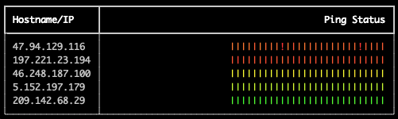

# Python script to ping multiple devices and display the status with history.

This is a simple script to make pinging and viewing the status of pinging multiple devices easy.

## Usage

```
usage: png [-h] [--maxLatency MAXLATENCY] [--minLatency MINLATENCY] [--interval INTERVAL] [--domain DOMAIN]
           ...

Ping multiple hosts and display the results in a table.

positional arguments:
  hosts                 Hostnames to ping.

options:
  -h, --help            show this help message and exit
  --maxLatency MAXLATENCY
                        The maximum latency for coloring and icmp timeout.
  --minLatency MINLATENCY
                        The minimum latency for coloring.
  --interval INTERVAL   The interval to ping the devices.
  --domain DOMAIN       Append domain if the host doesn't resolve. Default=[] or PNG_APPEND_DOMAINS
```

## Example

```
% png 1.1.1.1 8.8.8.8 192.0.2.1
┏━━━━━━━━━━━━━┳━━━━━━━━━━━━━━━━━━━━━━━━━━━━━━━━━━━━━━━━━━━━━━━━━━━━━┓
┃ Hostname/IP ┃                                         Ping Status ┃
┡━━━━━━━━━━━━━╇━━━━━━━━━━━━━━━━━━━━━━━━━━━━━━━━━━━━━━━━━━━━━━━━━━━━━┩
│ 1.1.1.1     │ ||||||||||||||||||||||||||||||||||||||||||||||||||| │
│ 8.8.8.8     │ ||||||||||||||||||||||||||||||||||||||||||||||||||| │
│ 192.0.2.1   │ !!!!!!!!!!!!!!!!!!!!!!!!!!!!!!!!!!!!!!!!!!!!!!!!!!! │
└─────────────┴─────────────────────────────────────────────────────┘
```




You can include comment lines by starting the host with a `/`.

## Installing from pypi

```bash
python3 -m pip install alphabet5-ping
```

## Building and Installing

```
python3 -m pip install wheel -y
python3 -m pip uninstall alphabet5-ping -y
python3 setup.py bdist_wheel --universal
python3 -m pip install dist/alphabet5_ping-*-py2.py3-none-any.whl
```

## Offline installation for Windows

```bash
python3.11 -m pip download --platform win_amd64 --only-binary=:all: rich
```

Copy the .whl generated with the 'Building and Installing'  step above, as well as the downloaded .whl files from the command ^ to the remote computer it their own folder. Open a command window in that folder and run the install command.

Install Command

```bash
python3.11 -m pip install *.whl
```

## Changelog

### 0.0.1
- Initial Release

### 0.0.2
- Initial support for windows

### 0.0.5

This update simplifies quite a few things. Instead of brute-forcing the colors, some logic was added.

The queue setup was replaced with a ThreadPoolExecutor that seems to work just as well. This also better supports error handling, and just gets the IP addresses once per startup and pings by ip instead of by hostname. This also allows for appending custom domains to the hostnames either via environment variable, or by adding --domain example.local, each domain will be tried in order, and the first to resolve will be used (including no domain.)

This also fixes some setup info.

### 0.0.6

Set screen=True and update the refresh interval, to reduce the flickering.
